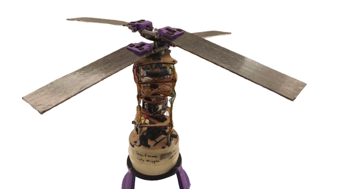
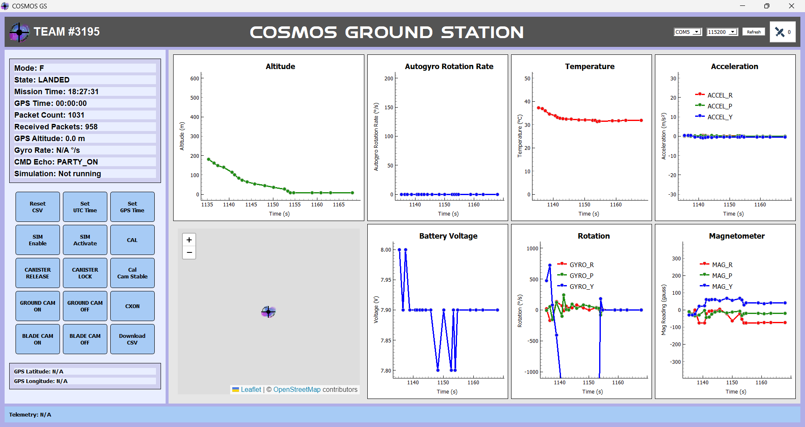

# COSMOS GCS/FSW

Cansat Competition Description:
- The Cansat competition is a design-build-fly competition that provides teams with an
opportunity to experience the design life-cycle of an aerospace system. The Cansat
competition is designed to reflect a typical aerospace program on a small scale and includes
all aspects of an aerospace program from the preliminary design review to post flight review.
The mission and its requirements are designed to reflect various aspects of real world
missions including telemetry, communications, and autonomous operations. Each team is
scored throughout the competition on real-world deliverables such as schedules, design
review presentations, and demonstration flights.

Mission Overview:
- Design a Cansat that consists of a payload and a container that mounts on top of the rocket.
The payload rests inside the container at launch and includes the nose cone as part of the
payload.
- The container with the payload shall deploy from the rocket when the rocket reaches peak
altitude and the rocket motor ejection forces a separation. The container with the payload
shall descend at a rate of no more than 20 meters/second using a parachute that
automatically deploys at separation.
- At 75% peak altitude, the payload shall separate from the container and descend using an
auto-gyro descent control system until landing. The descent rate shall be 5 meters/second.
- A video camera shall show the separation of the payload from the container and the auto-gyro
functioning. A second video camera shall be pointing downward at 45 degrees from nadir
and oriented north during descent and be spin stabilized so that the view of the earth is not
rotating.
- The Cansat shall collect sensor data during ascent and descent and transmit the data to a
ground station at a 1 Hz rate. The sensor data shall include interior temperature, battery
voltage, altitude, auto-gyro rotation rate, acceleration, rate, magnetic field, and GPS position.

Cansat:

Ground Station:

Software Contributors:
- `GCS`:
  - Diego Romero-Cardona

- `FSW`:
  - Caleb Wiley
  - Akhil Samiraju
  - Barrett Twining
  - Diego Romero-Cardona

- `PID Board`:
  - Caleb Wiley
  - Barrett Twining
  - Luke Wiggins

Competition Flight Data:
